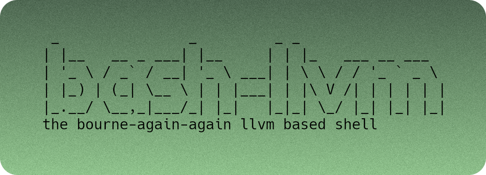

`bash-llvm` is Bash implementation built for modern age. Built from the ground up with security and performance in mind.

`bash-llvm` has an about a 20x runtime speed improvement over GNU Bash, read
the [release blog post](https://foxmoss.com/blog/llsh/) for more details!

## Usage

I feel kind of silly writing a syntax example for Bash but here we are.

To run a program it's as simple as writing out its name.

```e
fastfetch
# will run fastfetch
```

Some programs are special and interact nicely with your shell.

```e
echo "Hello World"
# prints "Hello World"
```

If you want to run another program after the first one completes you can use &&.

```e
termdown 20m && poweroff
# will poweroff your machine after 20 minutes while still being cancelable
```

There's a lot more features like if statments, for loops, while loops, ranges,
piping but that's all for the basic usage.

## Installing

If you would like the quick easy way out to install BASH-LLVM on Linux, run the installer
```sh
bash -c "$(COLUMNS=50 curl https://raw.githubusercontent.com/FoxMoss/llsh-installer/refs/heads/main/install.sh -#)"
```

Code is fully auditable at [llsh-installer](https://github.com/FoxMoss/llsh-installer).

## Building

Requirements:
- **CMake** 3.5 or above
- **A C & C++ compiler** C++23 support needed 
- **Ninja** or make if you know how to use it
- **patch**
- **git**

All other dependencies are handled by CMake and CPM, and fetched in at build time.

These should be relatively easy to find on Arch Linux and Alpine Linux (edge repos) 

```sh
mkdir -p build
cd build
cmake .. -DCMAKE_BUILD_TYPE=Release -GNinja
ninja
sudo ninja install
```
